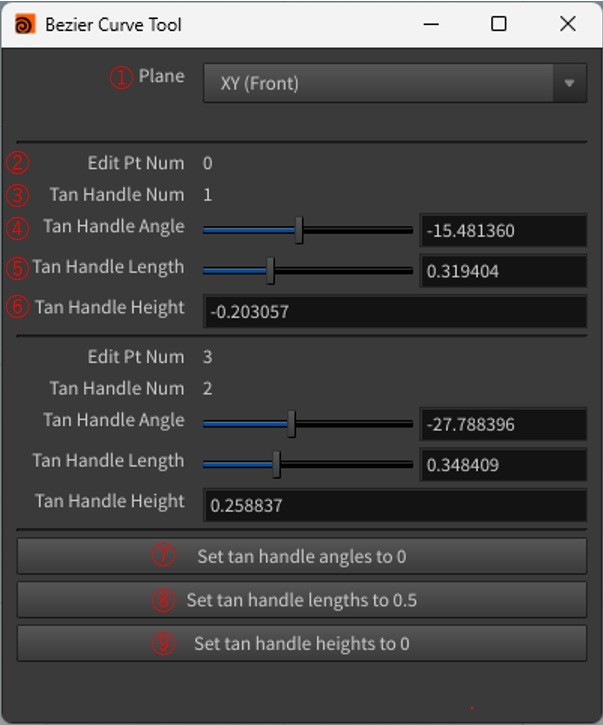

# [Houdini] Bezier Curve Tool
Curveノードのベジェ曲線をGUIで制御するツールです。接線ハンドルの角度や長さを数値で指定したいと思い、作成しました。

## 動作確認環境
Houdini Indie Limited-Commercial 21.0.440
## 導入方法
本ツールはシェルフツールですので、使用前に登録をお願いします。
- 必要であれば、新しいシェルフタブを作成します。+をクリックして、New Shelf Tab...をクリックします。 
- 各項目を設定して、Acceptをクリックします。 
- 作成したシェルフタブを右クリックして、New Tool...をクリックします。 
- 各項目を設定します。 
- Scriptタブをクリックして、本リポジトリのscript.pyの内容をコピー&ペースト、Acceptをクリックします。 
- 作成したツールをクリックして、以下のようなウィンドウが表示されたら導入完了です。 
## 用語説明
公式と同じですが、簡単に図解します。

[Curveノードの公式ドキュメント](https://www.sidefx.com/docs/houdini/nodes/sop/curve.html)

## 使用方法
- Curveノードの**Primitive TypeをBezier Curveに設定**して、曲線を作成しておきます。Curve tool自体の使い方に関しては、他の資料をご参照ください。 
- ツールをクリックします。 
- Curveノードをクリックします。 
- Handles toolをクリックします。 
- セグメントをクリックすると、GUIの一部が有効になり、操作できるようになります。詳細に関しては「GUI説明」をご参照ください。 
## GUI説明

| | | |
| - | - | - |
| 1 | Plane | どの平面(視点)で作業するかを設定します。 XY (Front)/YZ (Right)/ZX (Top) |
| 2 | Edit Pt Num | 選択中の編集ポイント番号です。 |
| 3 | Tan Handle Num | 選択中の接線ハンドル番号です。 |
| 4 | Tan Hadle Angle | 接線ハンドルの角度を設定します。  |
| 5 | Tan Handle Length | 接線ハンドルの長さを設定します。1で編集ポイント間の距離と同じ長さになるように、正規化されています。 |
| 6 | Tan Handle Height | 接線ハンドルの高さを設定します。 ZX (Top)の例:  |
| 7 | Set tan handle angles to 0 | 各接線ハンドルの角度を0に設定します。 |
| 8 | Set tan handle lengths to 0.5 | 各接線ハンドルの長さを0.5(セグメントの中央)に設定します。 |
| 9 | Set tan handle heights to 0 | 各接線ハンドルの高さを0に設定します。 |
## お詫び
本ツールは公式のCurve toolを外部から無理やり制御しています。そのため、エラーが発生する事がありますが、手元ではクラッシュまでは発生していないため許容としています。あらかじめご了承ください。
